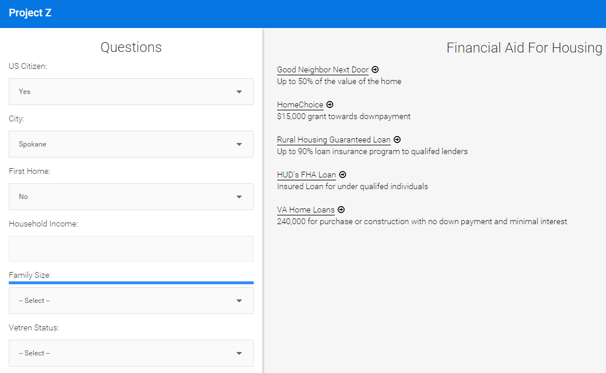

# Hack Housing: Project Zed

Information about grants and loan programs that are currently being active and accepting applicants is to some extent an arcane subject. Trying to research these programs online can be difficult and hard to find with many links being outdated or no-longer active. In order to assist first-time home buyers, low-mid income families / individuals, and those of a protected classes we have synthesized information about these programs into an easily searchable database based on demographic parameters and other information that would allow people to qualify for these programs.

Our app is live at https://tranquil-ocean-4871.herokuapp.com/. 

## Challenge and Approach

Our submission is primarilarly targted at assisting first-time homebuyers.

Our approach for satisfying their needs was to:

- Synthesize find home-buying assistance programs.
- Allow people to easily find what programs they are eligable for.
- Provide them with more information about these programs and how to apply for them.

## Team Members

Our team is comprised of:

- [@WardenUnleashed](http://twitter.com/WardenUnleashed) - University of Washington Math student and Property Manager to Be.
- [@IanSmith9876](https://github.com/iansmith9876) - SparkCRM employee and ruby developer
- [@Brad](http://ca.linkedin.com/pub/brad-katronis/10/979/b47) - Property and Project Manager
- [@makefire](https://github.com/makefire) - Amazon employee and ruby developer
- [@Chowicus](http://github.com/chowicus) - Alex Chow is a student at the University of Washington trying to gain work experience in the field.

## Technologies, APIs, and Datasets Utilized

We made use of:

- Ruby on Rails
- PostgreSQL Database
- HUD's Housing Counseling Agency Database

## Contributing

In order to build and run our app:

1. [Clone the code](https://github.com/makefire/projectz) and run in own Ruby on Rails environment.
2. Profit

Our code is licensed under the [MIT License](LICENSE.md). Pull requests will be accepted to this repo, pending review and approval.
